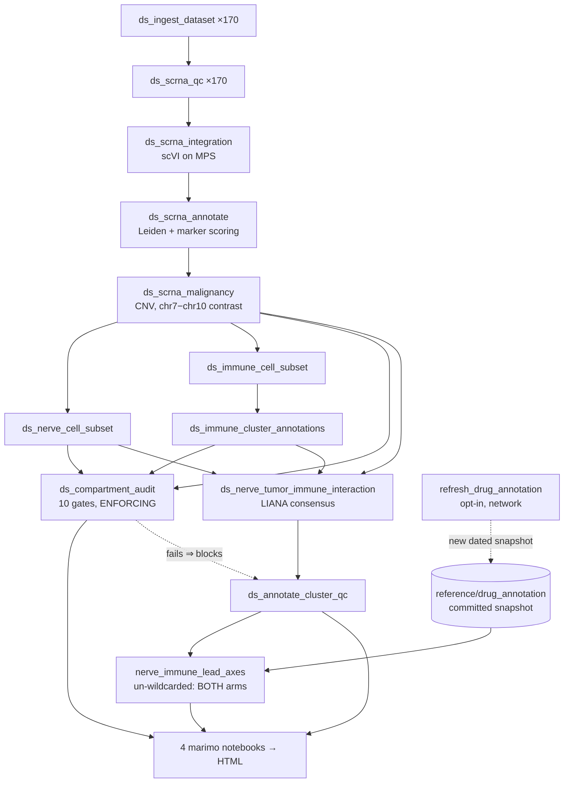

# GBM Nerve–Tumor–Immune Single-Cell Analysis

A FAIR-compliant single-cell RNA-seq pipeline characterising nerve-cell heterogeneity in the glioblastoma (GBM) tumour microenvironment, and the ligand–receptor crosstalk connecting the tumour and immune compartments to it. Snakemake + scvi-tools + scanpy + LIANA + marimo, on Apple Silicon (MPS).

The analysis runs on a **170-donor CELLxGENE Census cohort**, carried as two arms at different sequencing depths. Every compartment is audited against a held-out external annotation before any result is read.

---

## Read this first

**A 17-sample TCGA-GBM cohort was the project's original discovery set. It is no longer part of the analysis.**

On 2026-08-06 a compartment-integrity defect was found and fixed. The "nerve" compartment had been built by a silently bidirectional substring match on `cell_type_predicted`, and it was **59 % malignant and 27 % myeloid — only ~11 % neural**. Every nerve-side result computed before that date describes tumour and microglia under a nerve label.

The Census arms were rebuilt with the corrected mask and now pass **10/10 enforcing compartment gates**. The TCGA reference could not be: its `data/processed/nerve_cells.h5ad` was destroyed by a failed job on 2026-07-21, the surviving tables are structurally pinned at v1.3.0, and — decisively — its `nerve_cell_subset` run is insulated by a v1.1.0 frozen barcode list that **bypasses the fixed mask entirely**. Re-running it today would faithfully reproduce the defect.

So the TCGA cohort is retained as a frozen, citable record and is **not a valid comparator**. Replication evidence in this project is **cross-arm agreement between the two Census arms**, not agreement with the old baseline. Its notebooks live in `notebooks/archive/`.

| | Census — full arm | Census — capped arm | TCGA reference |
|---|---|---|---|
| **Key** | `gbm_cellxgene_56c4912d_full` | `gbm_cellxgene_56c4912d` | — |
| **Donors** | 170 | 170 | 17 samples |
| **Cells** | 1,020,902 → 1,006,344 post-QC | 624,688 | subsampled loom |
| **`subsample_per_donor`** | `null` | 5,000 | — |
| **Compartment gates** | **10/10 PASS** | **10/10 PASS** | not auditable |
| **Nerve compartment** | 95.4 % neural | 94.8 % neural | ~11 % neural (defective) |
| **Status** | active | active | frozen v1.3.0, **archived** |

Both arms are kept because a result that holds at one sequencing depth and not the other is not a result. Capping is not free — it discards real cells — so neither arm is authoritative alone.

---

## Scientific questions

**1. Composition.** Which nerve-cell subtypes are present in the GBM TME, how heterogeneous are they across donors, and which molecular programs define each?

**2. Crosstalk.** Which ligand–receptor interactions link malignant and immune cells to the nerve compartment — the tumour → immune → nerve axis?

**3. Reproducibility.** Which of those interactions hold in **both** Census arms, and are any of them pharmacologically reachable?

The chain: ingest per donor → scVI batch correction → marker-based annotation → CNV malignancy calling → compartment masks (nerve / tumour / immune) → **compartment audit against a held-out oracle** → LIANA ligand–receptor scoring → cross-arm lead-axis shortlist with druggability tiers.

---

## The audit that gates everything

The single highest-leverage decision in this project was pulling CELLxGENE's author `cell_type` annotation and **never letting it touch the pipeline**. It is held out entirely and used only to audit the compartments the pipeline builds for itself.

`ds_compartment_audit` runs ten gates as **hard build gates** — a failure stops the run, so a defective compartment cannot silently reach an interaction table again:

| gate | full arm | threshold |
|---|---|---|
| `nerve_neural_fraction` | 0.954 | ≥ 0.80 |
| `tumor_malignant_fraction` | 0.930 | ≥ 0.85 |
| `malignancy_recall` | 0.894 | ≥ 0.80 |
| `malignancy_precision` | 0.930 | ≥ 0.85 |
| `immune_purity` | 0.996 | ≥ 0.95 |
| `max_nerve_cluster_endothelial_fraction` | 0.000 | ≤ 0.20 |
| + 4 size/shape gates | | |

Rendered in `notebooks/06_census_compartment_audit.py`. **Read that notebook before trusting any result here** — it also shows that 5 of 23 nerve clusters in the full arm sit below the 0.80 neural bar despite the aggregate passing, which the aggregate figure alone would hide.

The TCGA reference carries no author annotation, so none of this can be computed for it. That asymmetry is why it was archived rather than rebuilt.

---

## Quick start

> **Always invoke through `scripts/run_snakemake.sh`.** A bare `snakemake` — or `claude_science/bin/python3 -m snakemake` — inherits an active venv from the calling shell, which shadows the conda environments and silently un-enforces every pin in `workflow/envs/*.yaml`. `--use-conda` is also **not optional**: without it Snakemake's unquoted interpreter path splits on the space in "Biomedical Data Science" and the run dies with an empty log and no traceback.

```bash
# 1. Dry run — confirm the DAG resolves and nothing unintended is scheduled
scripts/run_snakemake.sh --use-conda --cores 8 -n

# 2. Everything
scripts/run_snakemake.sh --use-conda --cores all

# 3. One arm, end to end (targets go FIRST — see below)
scripts/run_snakemake.sh \
  results/tables/gbm_cellxgene_56c4912d_full/compartment_audit_gates.csv \
  results/figures/gbm_cellxgene_56c4912d_full/05_census_nerve_immune_explorer.html \
  --use-conda --cores all --rerun-triggers mtime

# 4. Explore interactively
claude_science/bin/python3 -m marimo edit notebooks/06_census_compartment_audit.py
```

**Targets go first.** `--allowed-rules`, `--forcerun` and `--quiet` all take `nargs='+'` and will swallow any target placed after them.

For a long run: `tmux new -s gbmfull` and prefix with `caffeinate -ims`. macOS idle-sleep keys off user input rather than CPU load, so an overnight run gets suspended without it.

Full step-by-step instructions and troubleshooting: [`execution_instructions.md`](execution_instructions.md).

---

## Notebooks

Four marimo explorers, each built per arm (set `GBM_DATASET` to switch):

| Notebook | Scope |
|---|---|
| `01_census_cohort_qc.py` | Cohort scale, per-donor QC, filtering funnel, composition, marker detectability |
| `02_census_nerve_enrichment.py` | Nerve-cluster GSEA, shared-profile overlap, marker genes |
| `05_census_nerve_immune_explorer.py` | Three-way LR browser, interface matrix, **cross-arm lead axes** |
| `06_census_compartment_audit.py` | **The Test Oracle** — 10 gates, composition vs oracle, malignancy confusion, per-cluster purity |

`notebooks/archive/` holds the five superseded reference-cohort notebooks. They carry a `SUPERSEDED` banner, have no Snakemake rules, and are **not built** — their nerve-side numbers are void and cannot be corrected. Kept because the code becomes reusable if a v1.4.0 baseline is ever built through the corrected pipeline.

---

## Key outputs

**Per arm**, under `results/tables/{arm}/` and `results/figures/{arm}/`:

| File | Description |
|---|---|
| `compartment_audit_gates.csv` | The 10 enforcing gates and their verdicts |
| `compartment_audit.csv` | Compartment composition vs the Census oracle |
| `malignancy_confusion.csv` | CNV caller confusion matrix + false-positive breakdown by cell type |
| `nerve_compartment_cluster_audit.csv` | Per-cluster neural purity |
| `nerve_tumor_immune_interactions_with_qc.csv` | Three-way LR pairs, joined to cluster QC flags — **use the `_with_qc` tables** |
| `nerve_enrichment_with_qc.csv` | GO BP/MF enrichment per nerve cluster |
| `nerve_cluster_sample_purity{,_v2}.csv` | Donor purity, Leiden and scANVI-v2 |
| `05_census_nerve_immune_explorer.html` + 3 more | Rendered notebooks |

**Cross-arm**, at `results/tables/` root:

| File | Description |
|---|---|
| `nerve_immune_lead_axes_postfix.csv` | **183 rows / 144 axes** that clear significance in *both* arms, tiered by druggability (34 with an available approved agent, 18 withdrawn-only, 57 clinical-stage, 57 target-no-agent, 17 no target) |

**Committed reference data** (`reference/drug_annotation/`) — the one input that is not a computed artifact:

| File | Description |
|---|---|
| `nerve_immune_axis_drug_annotation_refreshed_2026-08-19.csv` | **ACTIVE** — re-derived from ChEMBL_37 + ClinicalTrials.gov v2 |
| `..._2026-08-07.csv`, `..._2026-08-19.csv` | Superseded snapshots, kept as audit records |
| `MANIFEST.json` | Provenance, drift table, and what the annotation can and cannot support |

---

## Project structure

```
Nerve_Analysis_TCGA_GBM/
├── CLAUDE.md                     # Project constitution — rules for all agentic work
├── CHANGELOG.md                  # Persistent lab notebook — every decision logged
├── execution_instructions.md     # Step-by-step execution guide
├── Snakefile                     # rule all + includes
├── config/config.yaml            # All parameters and paths (nothing hardcoded elsewhere)
│
├── workflow/
│   ├── rules/
│   │   ├── common.smk            # p(), BASELINE_PINNED, pinned_target()
│   │   ├── datasets.smk          # 22 cohort-namespaced ds_* rules (Stage A→D)
│   │   ├── leads.smk             # nerve_immune_lead_axes, derive_withdrawn_agents,
│   │   │                         #   refresh_drug_annotation
│   │   ├── notebooks.smk         # Marimo batch export (4 Census notebooks)
│   │   ├── nerve_cells.smk       # Reference-cohort nerve chain (pinned; mostly inactive)
│   │   ├── immune.smk, qc.smk, integration.smk, annotation.smk, ingest.smk
│   │   ├── fair.smk              # FAIR validation, provenance freezes, reference pin
│   │   └── proteomics.smk        # AlphaPept (optional)
│   ├── scripts/                  # One module per biological operation
│   │   ├── fair_utils.py         # Provenance (UUID5, SHA256, stamping), nerve_group_key
│   │   ├── compartment_audit.py  # The Test Oracle — 10 gates
│   │   ├── nerve_cell_subset.py  # Compartment mask (exact match) + re-cluster
│   │   ├── scrna_malignancy.py   # CNV chr7−chr10 contrast → is_malignant
│   │   ├── nerve_immune_lead_axes.py     # Cross-arm shortlist
│   │   ├── refresh_drug_annotation.py    # ChEMBL + ClinicalTrials.gov re-query
│   │   └── …
│   └── envs/                     # scrna / notebooks / proteomics / base conda envs
│
├── scripts/
│   ├── run_snakemake.sh          # ← THE entry point (see Quick start)
│   └── gbm_cellxgene_census_pull.py
│
├── reference/drug_annotation/    # Committed, version-pinned drug annotation + MANIFEST
├── notebooks/                    # 4 Census explorers
│   └── archive/                  # 5 superseded reference notebooks (not built)
├── results/{tables,figures}/{arm}/    # Outputs (gitignored)
├── provenance/                   # FAIR provenance JSON per rule output
├── markdowns/                    # Plans, assessments, blocker write-ups
└── claude_science/               # Python 3.12 venv (gitignored)
```

---

## Pipeline overview



Every rule declares its own conda env, `resources` and `threads`, and writes a `provenance/{arm}/{rule}_provenance.json` carrying a UUID5, input/output SHA-256s, tool versions and every parameter.

`nerve_immune_lead_axes` is deliberately **not** cohort-scoped — it intersects the two arms, so its output belongs to neither namespace and sits at the `results/tables/` root.

---

## Configuration

All parameters live in `config/config.yaml`.

| Section | Controls |
|---|---|
| `datasets` | The two Census arms — source, filters, sample key, per-donor cap |
| `scrna` | QC thresholds (`min_genes` 200, `max_genes` 6000, `max_pct_mito` 20), HVGs, scVI latent dims, seed |
| `nerve_cells` / `immune_cells` | Compartment definitions, Leiden resolution, marker panels, batch-QC thresholds |
| `compartment_audit` | The 10 gates and their thresholds |
| `lead_axes` | Significance filters, arm keys, and the **active drug-annotation snapshot** |
| `baseline` | v1.3.0 structural pin and its 37 pinned artifacts |
| `hardware` | MPS device, float32, memory watermark |
| `dirs` | All I/O paths |

Compartment membership is read from config **at runtime** by every consumer, never hardcoded — the definitions moved three times during the integrity fix, and a hardcoded copy would have overstated nerve 5× while looking plausible.

---

## FAIR compliance

- **Findable** — UUID5 identifier and SHA-256 for every artifact in `provenance/*.json`
- **Accessible** — data via standard APIs (CELLxGENE Census SOMA, ChEMBL, ClinicalTrials.gov); no hardcoded absolute paths
- **Interoperable** — AnnData `.h5ad` with Ensembl IDs and EDAM operation codes
- **Reusable** — every transformation logged with tool versions and parameters

`rule fair_validate_metadata` scans `provenance/` and is the first entry of `rule all`, so a new artifact without a provenance sidecar is flagged immediately.

---

## Hardware notes (Apple M4 Max)

- scVI/scANVI use the **MPS backend** (`accelerator="mps", devices=1`); **float32**, not float16 — MPS float16 is often slower on Apple Silicon
- **36 GB unified memory**, budget against ~30 GB usable. Snakemake's `resources: mem_mb` is a **scheduler gate, not a memory cap** — it cannot bound a single process on a local run. Only in-script chunking (`scrna.cnv_chunk_size`) actually bounds memory
- `NUMBA_THREADING_LAYER=workqueue` must be set **before** importing scanpy — numba's OpenMP pool collides with torch's libomp and `sc.pp.neighbors` SIGSEGVs after MPS init

---

## Caveats

1. **Masked labels are a decision, not a finding.** `astrocyte`, `opc`, generic `neuron` and `ependymal` are excluded from the nerve compartment by configuration. OPCs in particular (21,460 cells) sit at the best-characterised neuron–glioma interface in the literature; their absence from the interaction tables is a masking choice, not a negative result.
2. **Neuron-side axes are substantially one patient's biology.** The pooled neuron group is 4,275 cells from 7 contributing donors, dominant-sample fraction 0.5032. No pipeline correction lifts that ceiling. The glial side is well-powered by contrast (33,670 cells, 95.8 % neural).
3. **Batch QC flags, it does not clean.** Failing groups are retained with a `batch_qc_pass` boolean — the dominance test cannot separate real biology preserved in one donor's tissue from a patient-driven artifact, so dropping automatically would discard signal.
4. **`cellphone_pvals = 0` does not mean p = 0.** It is an empirical permutation p-value at `n_perms = 1000`, so the floor is p < 0.001. 59.9 % of rows sit at exactly 0, and 98.3 % under default filters — the column cannot rank anything. Use `magnitude_rank` and `lrscore`.
5. **The drug annotation is a snapshot, not a live query.** Re-derived from ChEMBL_37 and adopted 2026-08-19; every value traces to a recorded release. But glioma-trial coverage is bounded by a hand-curated 20-agent list, so an empty cell means *no named trial for a listed agent*, not that no trial exists. See `reference/drug_annotation/MANIFEST.json`.
6. **The compartment aggregate can hide contaminated clusters.** 5 of 23 nerve clusters in the full arm are below 0.80 neural (4.4 % of cells, three majority-malignant) while the compartment averages 95.4 %. `batch_qc_pass` does **not** cover this — it is donor dominance, not cell identity. Cross-reference the `nerve_cluster` column before reporting an axis that rests on them.
7. **No clinical metadata.** The Census cohort's `gdc_clinical.tsv` is a generated stub. Clinical association was possible only for the archived TCGA cohort and is genuinely lost with it.
8. **The TCGA reference cannot be regenerated** — see [Read this first](#read-this-first).
