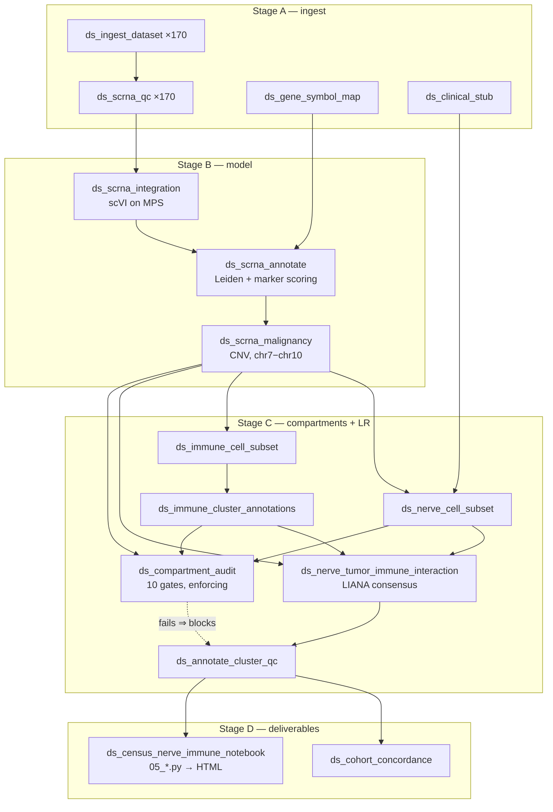

# Mapping Nerve–Immune Crosstalk in Glioblastoma Across a Million Cells

*A technical walkthrough of the full-cohort CELLxGENE Census run —
`gbm_cellxgene_56c4912d_full` — from raw atlas query to interactive explorer.*

**Draft — technical blog post.** Written 2026-08-10. Every number below comes from
an artifact on disk under `results/tables/gbm_cellxgene_56c4912d_full/` or
`provenance/gbm_cellxgene_56c4912d_full/`.

---

## The question

Glioblastoma does not grow in a vacuum. It grows in brain tissue, wired into
neurons and glia, and surrounded by an immune compartment that makes up more than
half the tumor mass. There is now good evidence that neurons form functional
synapses onto glioma cells and that this electrical coupling drives proliferation
— which raises an obvious follow-on question that is much less well characterised:

> **Which nerve cell types exchange ligand–receptor signals with which immune
> subtypes inside the GBM microenvironment?**

Answering it needs three things at once: enough neural cells to say anything
(they are rare in dissociated tumor tissue), enough donors that a result is not
one patient's biology, and a malignancy call clean enough that "nerve" means
nerve rather than a tumor cell wearing a neural transcriptional program.

This post walks through how that pipeline was built: the data pull, the Snakemake
workflow, and the marimo notebook that makes the output explorable.

---

## 1. Getting the data

The cohort comes from the **CZ CELLxGENE Census**, queried directly through the
SOMA API rather than downloaded as files (`scripts/gbm_cellxgene_census_pull.py`):

```python
adata = cellxgene_census.get_anndata(
    census=census,
    organism="homo_sapiens",
    obs_value_filter="disease == 'glioblastoma' and is_primary_data == True",
    column_names={"obs": ["dataset_id", "donor_id", "assay",
                          "cell_type", "tissue_general"]},
)
is_10x = adata.obs["assay"].str.contains("10x", na=False)
```

Three choices in that snippet matter:

- **`is_primary_data == True`** drops cells that appear in more than one Census
  study. Without it, meta-analysis re-depositions get counted twice and inflate
  every downstream count.
- **The 10x filter is applied locally, by substring.** The Census tracks each
  chemistry separately (`10x 3' v3`, `10x 5' v2`, …), so matching on `"10x"`
  captures all of them while dropping Smart-seq2 and Drop-seq. Mixing assay
  chemistries into one scVI batch correction is a bad idea; restricting to one
  platform family removes that variable.
- **`cell_type` is pulled and preserved.** This is the CELLxGENE author
  annotation, harmonized to the Cell Ontology. It is never used to build anything
  — it is held back as an **external oracle** to audit the pipeline's own labels
  against. That decision turns out to carry most of the project's credibility, and
  it comes up again in §5.

The full pull spans several studies. The analysis runs on the **single largest
one** (`dataset_id 56c4912d-2bae-4b64-98f2-af8a84389208`, **170 donors**) rather
than the pooled set, because pooling studies makes `dataset_id` and `donor_id`
collinear and there is then no honest way to separate study effects from
biological ones.

### Two arms, on purpose

The cohort is configured twice in `config/config.yaml`:

| arm | `subsample_per_donor` | cells |
|---|---|---|
| `gbm_cellxgene_56c4912d` | 5000 | 614,951 |
| `gbm_cellxgene_56c4912d_full` | `null` | 1,020,902 raw → **1,006,344 post-QC** |

These are **separate namespaces, not a config edit**. Raising the cap in place
would have overwritten 77 GB of the capped arm's artifacts and destroyed it as a
comparison arm. Keeping both means every result can be checked at two sequencing
depths — and, as it turned out, cross-arm agreement became a more useful
reproducibility signal than comparison against the project's own older baseline.

---

## 2. Preprocessing

Ingestion is per-donor and deliberately never loads the whole matrix
(`workflow/scripts/ingest_dataset.py`):

```python
backed = ad.read_h5ad(raw_file, backed="r")   # 1.02M × 24,048, stays on disk
mask &= (obs[sample_key].astype(str) == str(sample_id)).to_numpy()
```

Each of the 170 donors gets its own `data/processed/<dataset>/<donor>.h5ad` with
a fixed contract — `.X` = raw integer counts (float32), `.var` indexed by
`ensembl_id` with `gene_symbol` and an `mt` flag, `.obs` carrying
`batch` / `sample_id` / `dataset`. That contract is what lets every downstream
script be shared between this cohort and the original TCGA one without
modification.

Per-sample QC (`scrna_qc.py`) then applies:

| threshold | value |
|---|---|
| `min_genes` | 200 |
| `max_genes` | 6000 |
| `max_pct_mito` | 20 % |
| `min_cells` (gene-level) | 3 |

Thresholds are **logged before filtering, per sample**, and each donor emits a
`_qc_metrics.csv` and a `_gene_presence.csv`. The gene-presence table exists
because of an earlier lesson: an inner-join concatenation across many samples
silently collapses the gene space to whatever every sample happens to share.
Recording per-sample gene presence makes that failure visible instead of
mysterious.

Two more small Stage-A rules fill gaps specific to an atlas cohort:
`ds_gene_symbol_map` builds an Ensembl→symbol map from the cohort's *own* `.var`
(the reference cohort's MyGene cache does not cover these IDs), and
`ds_clinical_stub` emits a schema-compatible blank clinical TSV, because this
cohort has no GDC clinical metadata and the downstream join expects the file to
exist. The stub is inert by design — the notebook says so explicitly rather than
letting a reader mistake empty columns for measured ones.

---

## 3. The Snakemake pipeline

Every analytical step is a Snakemake rule. Nothing runs as a one-off script.

The interesting structural piece is **cohort namespacing**. The project already
had a working pipeline for a 17-sample TCGA cohort. Rather than fork it,
`workflow/rules/datasets.smk` redirects all I/O under a per-dataset prefix using
four path helpers:

```python
def _dp(*parts): return os.path.join(config["dirs"]["data_processed"], "{dataset}", *parts)
def _tb(*parts): return os.path.join(config["dirs"]["tables"],        "{dataset}", *parts)
def _fg(*parts): return os.path.join(config["dirs"]["figures"],       "{dataset}", *parts)
def _pv(*parts): return os.path.join(config["dirs"]["provenance"],    "{dataset}", *parts)
```

with wildcard constraints that stop a `{sample}` wildcard from swallowing the
dataset directory boundary:

```python
wildcard_constraints:
    dataset = "|".join(re.escape(d) for d in DATASETS) or "__no_datasets__",
    sample  = r"[^/]+",
```

The result is twenty `ds_*` rules that call the **same analysis scripts** as the
reference cohort, with everything cohort-scoped. The reference cohort is never
re-run and cannot be overwritten.



Each rule declares its own conda environment, `resources`, and `threads`, and
writes a `provenance/<dataset>/<rule>_provenance.json` carrying a UUID5, input and
output SHA-256s, tool versions, and every parameter. That is the FAIR reusability
requirement made mechanical rather than aspirational.

One hard-won operational note: `resources: mem_mb` in Snakemake is **a scheduler
gate, not a memory cap**. It cannot bound a single process's RAM on a local run.
On a 36 GB machine the only thing that actually bounds memory is in-script
chunking — hence `scrna.cnv_chunk_size: 10000`, sized so each CNV row-block is
~1 GB rather than the ~4.8 GB a larger chunk would need.

---

## 4. The modelling core

### Batch correction — scVI on Apple Silicon

`ds_scrna_integration` trains a scVI VAE per cohort, on the M4 Max MPS backend:

| parameter | value |
|---|---|
| `n_latent` | 30 |
| `n_layers` | 2 |
| `batch_key` | `sample_id` (= donor) |
| precision | **Float32** |
| `random_seed` | 0 |

Float32 rather than Float16 is deliberate: on Apple Silicon, MPS Float16 is
frequently *slower* than Float32, so the usual half-precision instinct is a
pessimisation here. The donor is the batch covariate — with 170 donors from a
single study, donor is the dominant technical axis.

### Annotation

`ds_scrna_annotate` runs Leiden clustering on the scVI latent and scores curated
marker panels per lineage, then assigns labels. The census it produces on the full
arm looks like this (top labels):

| label | cells | | label | cells |
|---|---:|---|---|---:|
| macrophage | 226,242 | | oligodendrocyte | 42,570 |
| microglia | 198,061 | | ependymal | 37,760 |
| tumor_gbm | 102,717 | | nk_cell | 16,040 |
| t_cell | 102,034 | | excitatory_neuron | 2,466 |
| neuron (generic) | 89,693 | | inhibitory_neuron | 2,204 |

The immune compartment dominates, as expected in GBM. Neural cells are scarce —
which is the whole reason a million-cell cohort was needed to get a workable
number of them.

### Malignancy — and why the CNV score is a *contrast*

`ds_scrna_malignancy` calls malignancy from copy-number inference: genes ordered
by true chromosomal coordinate, expression centred against a normal reference,
clipped at 3.0, then smoothed in 100-gene windows *within* each chromosome so no
window straddles a contig boundary. The normal reference is drawn from six immune
labels — the cleanest non-malignant population available, audited at over 99 %
pure (§5) — with the least-confident quartile dropped.

The part worth dwelling on is the **score definition**. The standard approach is a
genome-wide "spread" statistic: how much does this cell's smoothed profile deviate
overall? Measured on this cohort, that score ranked **normal neural cells higher
than malignant ones** (0.063 vs 0.057). The reason is structural, not a bug: an
oligodendrocyte differs from an immune reference across whole chromosomes for
reasons that have nothing to do with gene dosage. Cell-type identity and copy
number are confounded in a genome-wide spread.

Replacing it with a **directional contrast — chr7 gain minus chr10 loss** — cancels
that baseline, because both terms are measured inside the same cell:

```yaml
cnv_gain_contigs: ["7"]
cnv_loss_contigs: ["10"]
```

+7/−10 is a WHO 2021 diagnostic criterion for IDH-wildtype glioblastoma, and it
also emerged unprompted from this cohort as the single most-up and most-down
contig among Census-malignant cells (chr7 +0.043, chr10 −0.038). The effect was
decisive: **AUC 0.859 → 0.958**, and at a 2.0 SD threshold the caller went from
precision 0.62 / recall 0.40 to **precision 0.93 / recall 0.89**.

This is disease-specific by construction, and the config says so — a cohort with
no canonical signature sets both lists to `[]` and falls back to the genome-wide
spread.

### Compartments

Three compartments feed the interaction analysis, and all three definitions live
in config rather than in code:

- **tumor** — CNV `is_malignant == True`. Cuts across every annotation label.
- **nerve** — `excitatory_neuron`, `inhibitory_neuron`, `oligodendrocyte`, minus
  malignant cells. Neurons are pooled into a *single* LIANA group rather than
  split per Leiden cluster: ~4.3k neurons spread over 170 donors is a group, not a
  cluster set.
- **immune** — eight source labels (`microglia`, `macrophage`, `t_cell`,
  `nk_cell`, `b_plasma`, `neutrophil`, `dc`, `mast`), re-clustered and assigned
  subtypes.

Four neural labels — `astrocyte`, `opc`, generic `neuron`, `ependymal` — are
**excluded from the nerve compartment**, because measured against the Census
author annotation their non-malignant cells are only 10.0 %, 18.9 %, 40.6 % and
31.6 % truly neural respectively, against 99.5 % / 95.8 % / 83.9 % for the three
that were kept. The marker panels cannot separate normal OPCs and astrocytes from
OPC-like and AC-like *malignant* states, which is a real biological ambiguity
rather than a coding problem. Those cells remain annotated in every artifact —
their absence from the interaction tables is a **masking decision that has to be
reported as one**, and it is the largest scientific cost of the current setup.

---

## 5. The audit that gates everything

`ds_compartment_audit` is the piece I would keep if I could keep only one.

It cross-tabulates every compartment mask against the CELLxGENE author annotation
— the external oracle held back in §1 — and gates the pipeline on the result. In
enforcing mode, a breached gate hard-fails the rule and blocks every downstream
interaction output. On the full arm, all ten pass:

| gate | observed | required |
|---|---:|---|
| nerve compartment neural | **95.39 %** | ≥ 80 % |
| tumor compartment malignant | **92.96 %** | ≥ 85 % |
| malignancy precision | **0.930** | ≥ 0.85 |
| malignancy recall | **0.894** | ≥ 0.80 |
| immune purity | **99.63 %** | ≥ 95 % |
| worst nerve-cluster endothelial fraction | **0.0000** | ≤ 0.20 |
| nerve compartment *n* | **37,945** | 25k – 50k |
| pooled neuron group *n* | **4,275** | ≥ 1,500 |
| immune size vs baseline | **1.80×** | ≥ 0.85 |

Two design details are worth stealing:

1. **The audit writes an undeclared sidecar** to
   `results/compartment_audit_snapshots/<arm>/`. Snakemake deletes a failed job's
   *declared* outputs, so without this a failing gate would erase its own
   evidence. The sidecar survives the failure.
2. **The gates have both floors and ceilings.** `nerve_compartment_n` is bounded
   above as well as below, because a compartment that suddenly gets much *larger*
   is as suspicious as one that collapses — purity alone is not a size check.

This rule exists because it had to. An earlier version of this pipeline produced a
"nerve" compartment that was 59 % malignant and 27 % myeloid, with one cluster
92.9 % endothelial — and every gate above passed only after that was rebuilt from
annotation downward in August 2026. The strongest evidence that the rebuild worked
is not any single number: **each arm was corrected independently and each landed
within 1–4 % of its own Census neuroglial count.** Two cohorts of different
sequencing depth converging separately on their own ground truth is much harder to
manufacture by tuning than one arm clearing a threshold.

The practical lesson generalises: *hold back an external annotation, never let it
touch the pipeline, and make it a build gate.*

---

## 6. Ligand–receptor inference

`ds_nerve_tumor_immune_interaction` runs LIANA's consensus rank aggregate:

```python
li.mt.rank_aggregate(
    combined, groupby="cell_label", resource_name="consensus",
    expr_prop=0.10, groupby_pairs=groupby_pairs,
    n_perms=1000, seed=0, use_raw=False, n_jobs=snakemake.threads,
)
```

Two things make this tractable and correct.

**`groupby_pairs` restricts the search space.** Rather than testing all group
pairs, the rule enumerates only cross-compartment directional pairings —
tumor↔nerve, tumor↔immune, nerve↔immune, both directions each — giving **262
directional pairings** instead of the full quadratic blowup. Same-compartment
pairs are then defensively dropped again after the call.

**Expression comes from the shared parent object, not from the compartment
files.** The three compartment `.h5ad` files are on different scales — the
malignancy object holds raw counts while the nerve and immune subsets were already
normalized and log1p'd by their subset rules. Concatenating them and normalizing
the result transforms the tumor cells once and the nerve/immune cells twice, and
the defect hides because the combined `X.max()` is dominated by the raw malignant
cells so every naive scale check reports "counts". The fix is to take *expression*
from the shared parent (all three compartments are subsets of it) and use the
compartment files only for *labels*, with assertions that the three are pairwise
disjoint.

The full-arm run modelled:

| compartment | cells | groups |
|---|---:|---:|
| tumor (CNV-malignant) | 320,878 | 1 |
| nerve | 37,945 | 21 |
| immune | 593,264 | 5 subtypes |

producing **44,139 LR rows, 2,673 significant** at `magnitude_rank ≤ 0.05` —
30,622 immune–nerve, 11,280 nerve–tumor, 2,237 immune–tumor. Immune subtypes are
`microglia`, `tam`, `t_cell`, `nk_cell`, `dendritic`. Runtime for the three-way
call on ~952k labelled cells × 24,135 genes: roughly ten minutes.

`ds_annotate_cluster_qc` then joins the per-cluster batch-QC verdict onto every LR
row, producing the `_with_qc.csv` tables the notebook reads. Rows that fail are
**flagged, not dropped** — 15,504 of them on the full arm.

---

## 7. The notebook

`notebooks/05_census_nerve_immune_explorer.py` is a **marimo** reactive notebook:
plain Python, each cell a function whose arguments are its dependencies, so
marimo derives a DAG and re-runs only what a change affects. There is no hidden
execution-order state and no `.ipynb` JSON to diff. It is wrapped in a Snakemake
rule (`ds_census_nerve_immune_notebook`) that exports a self-contained HTML.

Before any panel renders, the notebook does two things most notebooks don't.

It **resolves every input path from `config.yaml`** and hard-stops with a build
command if anything is missing — including a distinct `[FAIR-ALERT]` branch for
the one input no rule produces (§8). And it **re-verifies the data at read time**:

```python
_spec_missing = int(interactions_df["specificity_rank"].isna().sum())
_inf = int(interactions_df["lr_logfc"].isin([float("inf"), float("-inf")]).sum())
```

If any row lacks a `specificity_rank` or carries an infinite log-fold-change,
that is the fingerprint of LIANA having been run on unnormalized counts, and the
notebook renders a red "do not trust these results" callout with the re-run
command instead of a green banner. A notebook that reads a table is a consumer of
someone else's assumptions; this one checks them.

### The panels

**Panel A — what the cohort is made of, and what was modelled.** A census of every
annotation label, coloured by which compartment it feeds, next to the compartment
sizes the LR run actually saw. Crucially, **compartment membership is read from
config at runtime, never hardcoded** — the definitions moved three times during
development, and a hardcoded copy would have overstated nerve 5× and understated
immune 3× while looking perfectly plausible. The panel states plainly that label
counts are upper bounds (compartments additionally drop CNV-malignant cells) and
that the tumor compartment cuts across every bar in the chart.

**Panel B — patient diversity.** Per-group dominant-sample fraction for both
compartments, with a 0.5 threshold line and failing groups in red. This is where
the pooled neuron group's problem is visible: `dominant_sample_fraction = 0.5032`
across only 7 contributing donors. **One donor supplies roughly half of all
neurons.** The panel says so in prose rather than leaving it to be read off a bar.

**Panel C — the interaction browser.** Reactive filters over compartment interface,
direction, nerve cell type, `magnitude_rank`, `cellphone_pvals`,
`specificity_rank`, and ligand/receptor substring search, feeding a paginated
table. Each metric has a click-to-expand inline definition.

**Panel D — the interface matrix.** Ligand–receptor pair counts by nerve cell type
× immune subtype, one heatmap per direction, stacked vertically and sized from
their own row counts. The callout is careful to say these are **counts, not effect
sizes** — a cell type spread over more clusters accumulates more pairs — and lists
any cluster whose dominant cell type disagrees with its marker-score argmax.

**Panel E — lead axes, curated against live.** The shortlist (§8) alongside the
same quantities recomputed from this cohort's live LR table, so any disagreement
is visible rather than assumed away. The key is `(axis, nerve_side)` and not
`axis` — 144 distinct axes over 183 rows, 39 ranked separately on both nerve
sides — and the notebook raises rather than silently collapsing them.

**Panel F — concordance with the pinned v1.3.0 reference.** Jaccard 0.439,
Spearman ρ 0.6182 over 1,724 shared pairs. The panel is titled *a diagnostic, not
a replication result*, and the callout explains why: the reference's own nerve
compartment was built by the logic this pipeline removed, it carries no author
annotation so has never been audited, and it was scored against
differently-normalized data. The telling detail is that **the two corrected arms
agree with each other markedly better than either agrees with the reference** —
which points at the reference as the outlier.

Finally, an **export button** writes the filtered view to CSV with a
`.provenance.txt` sidecar recording a SHA-256 prefix of every input file and every
filter value at the moment of export.

---

## 8. Where the shortlist came from

Panel E reads `results/tables/nerve_immune_lead_axes_postfix.csv` — 183 candidate
signalling axes, 128 on the oligodendrocyte side and 55 on the pooled-neuron side,
each tiered by druggability:

| tier | axes |
|---|---:|
| `1_approved_available` | 46 |
| `1b_approved_withdrawn_only` | 14 |
| `2_clinical` | 50 |
| `3_chembl_target_no_agent` | 38 |
| `4_no_chembl_target` | 35 |

**`rule nerve_immune_lead_axes` produces this table** (`workflow/rules/leads.smk`).
It was originally generated out of band using **Claude Science**, and that
generator has since been reimplemented as a pipeline rule which reproduces the
original artifact byte-for-byte — that exact match is what establishes the
reimplementation is faithful rather than merely plausible.

The table is two independently-built halves concatenated, and they do not share a
selection rule. The oligodendrocyte side is aggregated over batch-QC-passing rows
from all nerve clusters in the **full** arm; the neuron side over rows from the
pooled `nerve_neuron` group in the **capped** arm, deliberately **without** the QC
filter, because that group fails donor QC in the full arm and filtering would
empty the neuron side rather than caveat it. An axis appears only if it clears the
bar in both arms. Magnitudes and row counts are reported per arm
(`full_best_mag` / `capped_best_mag`, `full_n_rows` / `capped_n_rows`) so no cell's
meaning depends on which half its row sits in — but they remain comparable
*within* a compartment side, not across the two, because the underlying filters
differ. Panel E re-derives every value independently from the LR tables and
currently agrees on 183/183 in both arms; a disagreement there is a regression,
not a caveat.

**What is still not recomputable is the drug annotation.** `tier_v2`,
`agents_flagged`, `glioma_trials` and `withdrawn` came from ChEMBL and
ClinicalTrials.gov queries whose response caches did not survive the session, and
one input — a prior-session artifact referenced only by UUID — is permanently
lost. They are supplied by a committed, version-pinned snapshot under
`reference/drug_annotation/`, joined on `axis`, which is lossless because all four
are a pure function of the axis string. That closes the provenance and versioning
gaps; it does not make the annotation reproducible, and
`reference/drug_annotation/MANIFEST.json` says so plainly — including that the
ChEMBL release behind it was never recorded, and that glioma-trial coverage is
bounded by a hand-curated 20-agent list, so an empty cell means *no named trial
for a listed agent*, not that no trial exists.

---

## 9. Reading the output honestly

Four caveats travel with every result above, and all four are surfaced in the
notebook itself rather than buried here.

**Masked labels are a decision, not a finding.** `astrocyte`, `opc`, generic
`neuron` and `ependymal` are absent from the interaction tables because they were
masked out, not because they don't participate in crosstalk. OPCs in particular
(21,460 cells) sit at the best-characterised neuron–glioma interface in the
literature, and excluding them is the biggest open cost.

**Neuron-side axes are substantially one patient's biology.** The pooled neuron
group is 4,275 cells drawn from only **7 contributing donors**, with a dominant-
sample fraction of 0.5032 — one donor supplies roughly half of it. (The Census
annotation independently calls just 3,401 neurons in the whole 1.006M-cell cohort,
~0.34 %.) That is a ceiling no pipeline correction can lift. Any neuron-side claim
should either state this plainly or be restricted to axes surviving a
leave-that-donor-out check. The glial side is well-powered by contrast: 33,670
cells at **95.8 % neural** against the Census oracle.

**Batch QC flags, it does not clean.** 9 of 24 nerve groups fail the
dominant-sample test, and 15,504 LR rows carry `batch_qc_pass = False`. They are
retained deliberately — the dominance test cannot distinguish "real biology
preserved in one donor's tissue" from "patient-driven artifact", so dropping them
automatically would discard real signal.

**`cellphone_pvals = 0` does not mean p = 0.** It is an empirical permutation
p-value at `n_perms = 1000`, so the smallest resolvable value is 0.001 and `0.000`
means *zero of 1000 shuffles reached the observed value* — i.e. **p < 0.001,
censored at the resolution floor.** With immune clusters of median 8,436 cells the
permutation null concentrates so tightly that any consistently non-zero difference
clears all 1000 draws: 59.9 % of all rows sit at exactly 0, and under the default
filters **98.3 % do**. Practically, the column cannot rank anything (26,446 rows
are tied at the floor), and with 44,139 tested rows a Bonferroni threshold would be
≈1.1×10⁻⁶ — three decades below what 1000 permutations can resolve. Ranking has to
come from `magnitude_rank` and `lrscore`.

---

## 10. Reproducing it

```bash
tmux new -s gbmfull

caffeinate -ims /usr/bin/time -l \
scripts/run_snakemake.sh \
  results/tables/gbm_cellxgene_56c4912d_full/cohort_concordance_summary.json \
  results/figures/gbm_cellxgene_56c4912d_full/05_census_nerve_immune_explorer.html \
  --use-conda --cores all --rerun-triggers=mtime \
  2>&1 | tee logs/full_cohort_run_$(date +%Y%m%d_%H%M%S).log
```

Four non-obvious pieces:

- **Launch through `scripts/run_snakemake.sh`.** A bare `snakemake` inherits an
  active venv from the calling shell, which shadows the conda environments and
  silently un-enforces every pin in `workflow/envs/*.yaml`.
- **`--use-conda` is not optional.** Without it, Snakemake's unquoted interpreter
  path splits on the space in "Biomedical Data Science" and the run dies with an
  empty log and no traceback.
- **Targets go first.** `--allowed-rules`, `--forcerun` and `--quiet` all take
  `nargs='+'` and will swallow any target placed after them.
- **`caffeinate -ims`.** This machine idle-sleeps after one minute, and macOS idle
  sleep keys off user input rather than CPU load — an overnight run gets suspended
  mid-training without it.

Budget overnight-plus: 170 ingest and 170 QC jobs run fast and in parallel, then
the singletons serialise, with scVI integration the long pole.

---

## What I'd tell someone starting a similar project

**Hold back an external annotation and make it a build gate.** The single highest-
leverage decision here was pulling CELLxGENE's `cell_type` and never letting it
touch the pipeline. It is the difference between "the compartments look
reasonable" and "the compartments are 95.4 % correct against an independent
oracle, and the build fails if they stop being."

**Watch for metrics that are confounded with the thing you're measuring.** The
genome-wide CNV spread score ranked normal oligodendrocytes above tumor cells, and
it would have kept doing so quietly forever. A within-cell contrast fixed it. The
plumbing around it mattered much less than the score definition.

**Prefer flagging to dropping, and say which you did.** Every table here retains
its QC failures with a boolean rather than filtering them out, and the notebook
reports masking decisions as decisions. It makes the output longer and harder to
skim, and it is the only way a reader can tell the difference between "we found no
signal" and "we removed the cells that would have carried it."

---

*Cohort: `gbm_cellxgene_56c4912d_full` — CELLxGENE Census GBM 10x, 170 donors,
1,006,344 cells post-QC. Pipeline: Snakemake + scvi-tools + scanpy + LIANA +
marimo on Apple M4 Max (MPS). Full audit trail in `CHANGELOG.md`; open items in
`markdowns/post_compartment_fix_next_steps.md`.*
